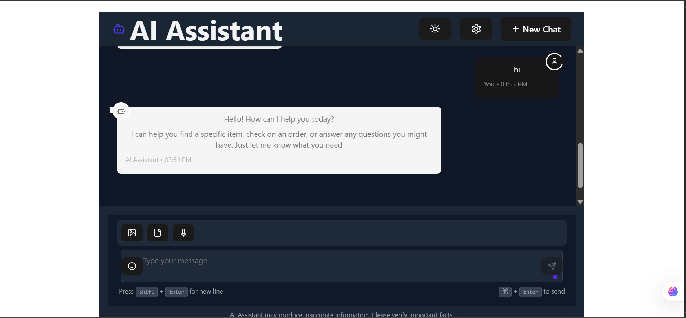

# 🧠 Chatbot E-commerce

A full-stack AI chatbot-based e-commerce assistant built with **React (Vite)** for the frontend, **FastAPI** for the backend, and **PostgreSQL** for data persistence. The chatbot integrates with **Gemini AI (Google Generative AI)** for dynamic responses.

---

## Image




## 📁 Folder Structure

```
chatbot-ecommerce/
├── backend/
│   ├── api/
│   ├── db/
│   ├── models/
│   ├── main.py
│   └── requirements.txt
├── frontend/
│   ├── src/
│   ├── public/
│   ├── index.html
│   └── Dockerfile
├── docker-compose.yml
├── .env (optional)
└── README.md
```

---

## 🚀 Features

- 💬 Real-time chatbot using Google Gemini Pro API
- 🧠 Context-aware conversation system with message history
- 🖥️ Beautiful animated UI with React, TailwindCSS, Framer Motion
- 🛠️ Full backend with FastAPI, PostgreSQL, and ORM models
- 🐳 Fully containerized using Docker & Docker Compose

---

## ⚙️ Tech Stack

| Layer      | Technology         |
|------------|--------------------|
| Frontend   | React + Vite + Tailwind CSS + Framer Motion |
| Backend    | FastAPI + SQLAlchemy |
| AI         | Gemini Pro API (Google Generative AI) |
| Database   | PostgreSQL |
| DevOps     | Docker + Docker Compose |

---

## 🧪 Local Development Setup

### 1️⃣ Clone the Repository

```bash
git clone https://github.com/DevanshBajpai09/Chat-bot-ecommerce.git
cd chatbot-ecommerce
```

---

### 2️⃣ Set up Environment Variables

Create a `.env` file in the **root** directory:

```env
GOOGLE_API_KEY=your_google_api_key
DATABASE_URL=postgresql://devansh:secret@db:5432/chatdb
```

---

### 3️⃣ Run with Docker 🐳

> ⚠️ Ensure Docker and Docker Compose are installed on your system.

```bash
docker-compose up --build
```

- Frontend: http://localhost:3000
- Backend (Swagger Docs): http://localhost:8000/docs
- PostgreSQL: port 5432 (user: `devansh`, password: `secret`)

---

## 🧠 Gemini AI Integration

We use Google’s Gemini Pro model:

```python
import google.generativeai as genai

genai.configure(api_key="YOUR_API_KEY")
model = genai.GenerativeModel(model_name="models/gemini-pro")
response = model.generate_content("Tell me a joke")
```

Make sure your API key has access to the Gemini API:
- [Enable Gemini API here](https://makersuite.google.com/app)

---

## 🐞 Common Issues & Fixes

| Problem | Solution |
|--------|----------|
| `ModuleNotFoundError: No module named 'backend'` | Change imports to `from db import SessionLocal` (not `backend.db`) |
| `frontend exited with code 0` | Make sure Vite is building successfully & `dist/` exists |
| `Gemini: API key not valid` | Ensure you're using a correct API key & it's enabled for Gemini |

---

## 📦 Frontend Commands (Inside `/frontend`)

```bash
npm install
npm run dev       # for local dev
npm run build     # build production version
```

---

## 🚧 Backend Commands (Inside `/backend`)

```bash
pip install -r requirements.txt
uvicorn api.main:app --reload
```

---

## 👤 Author

**Devansh Bajpai**  
📧 devanshbajpai09@gmail.com  
🔗 [LinkedIn](https://linkedin.com/in/devanshbajpai09)  
🔗 [GitHub](https://github.com/DevanshBajpai09)


